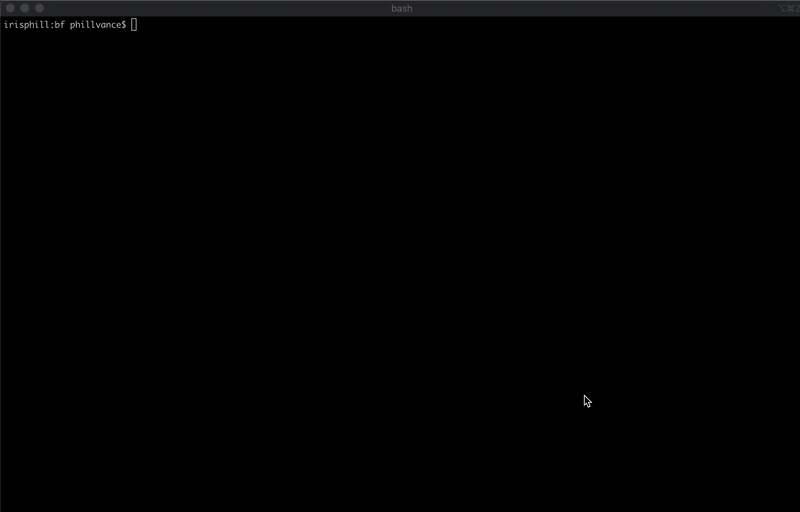

## Brain F interpreter and Compiler with TCC
Experimenting with using TCC and Yasm to compile to binaries. I didn't love TCC, and I think I almost prefer compiling to assembly with yasm. Started out in pure C, but then constructing strings got really annoying so I switched to C++. I've included a single additional langauge command, `~` which dumps 100 cell values for debugging

#### bf compiler
Run the interpreter
```sh
bf hello_world.bf
```
Compile to binary via tcc
```
bf -c hello_world.bf
```

On MacOS compile via yasm (requires system linker in path)
```
bf -mac hello_world.bf
```

#### TCC as a backend
As previously mentioned it wasn't great. First of all TCC has very scare documentation so it took a while to figure out how to use libtcc as a library. Also one thing I've found very strange is that you must link to `libtcc1.a` at runtime. This is very strange to me, I'm not sure why it isn't just a dynamic library instead of an archive file, and more than this why isn't it a real static library that I can just link with at compile time. Another annoyance is that TCC seems to be really particular about syntax, for example, it wouldn't allow me to use `#define` after the includes, in fact I couldn't get it to allow the `#define`s I wanted at all. It seems that TCC can't link to normal static libraries built with clang or another compiler. I tried a project using Raylib and could only successfully link with a dynamic library. I thought maybe I could get around this by compiling to an object file and then linking with the system linker, however, TCC uses some custom format for its archive and object files and `ld` doesn't actually understand how to link tcc .o files. I think maybe TCC is sort of like emscripten and wasm. If you want to use libraries they must be compiled from source using the compiler in order to be compatible. 

#### Yasm as backend
Yasm is more flexible as a backend, but of course there are some platform specific things and I'm relying on the platform linker. I tried LLVM's linker which did work, however it requires the linker and libLLVM which is over 100 MB alltogether, so I didn't keep it here. The main downside with Yasm is obviously Assembly is more verbose and actually the TCC executable was about 10kb smaller than the yasm version, though they were both small (21K vs 34kb). That is probably because of the way I programmed it, as I could have put more things in the bss section, however it is still small enough.

#### Building
requires C++ 17. makefile provided for unix (developed on Mac OS).
```
make 
./bf
Usage: bf [options] file_path

Options: 
    -h, --help      Display this message
    -c              Compile to executable via TCC for Mac or Linux
    -mac            Compile to executable via Yasm for x64 Mac
```
The `bf` executable requires the `backends` folder to be next to it



